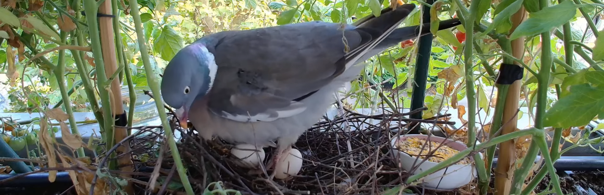

# PigeonCamSteward

A configurable toolkit for unattended, long-duration (multi-week) 24/7
livestream — a wildlife nest camera is the
reference use case, from a single fixed USB webcam to YouTube Live, on
modest or older Linux hardware. Built on [ffmpeg](https://ffmpeg.org/) +
systemd, not [OBS](https://obsproject.com/) (the correct tool for
human-in-the-loop interactive streaming): no GUI needed, nor desirable,
for a reliable static single-source feed. Reliability instead comes from
a belt-and-suspenders stack of independent control loops watching over
the stream — see [Architecture](#architecture) below.

The reference deployment (this repository) is a wood pigeon (*Columba
palumbus*) nest camera on a residential balcony. Every default is
overridable via `config.yaml`, so the toolkit works for other subjects,
cameras, and hardware too.



## Architecture

Three independent control loops around the core ffmpeg process, plus two
verification/escalation steps layered on top:

1. **systemd `Restart=always`** recovers from ffmpeg *exiting*.
2. **The watchdog** (`pigeoncam-watchdog.sh`, FR7) recovers from ffmpeg
   *hanging while still running* — a failure `Restart=always` can't see. A
   stall that survives one plain restart escalates to a USB-level device
   reset (`pigeoncam-usb-reset.sh`, FR7b) before retrying.
3. **The rotation timer** (`pigeoncam-rotate.sh`, FR14) is a deliberate,
   scheduled restart to stay under YouTube's ~12h continuous-archive
   ceiling — a policy action, not a failure recovery, kept deliberately
   separate from the watchdog.
4. **The external status check** (`pigeoncam-status-check.sh`, FR7c/d/e)
   verifies YouTube itself is actually broadcasting — a signal none of the
   above can see, since the "Preparing stream" hang looks perfectly healthy
   locally. Classifies every poll as confirmed-live, confirmed-not-live, or
   indeterminate, and only confirmed-not-live can trigger a (plain) restart.

Full diagram and reasoning: [SPEC.md §4](SPEC.md#4-architecture-overview).

## Quickstart

### 1. Install dependencies

```bash
sudo apt update
sudo apt install -y ffmpeg v4l-utils usbutils procps jq uhubctl yq shellcheck
```

`yq` here is the [kislyuk/yq](https://github.com/kislyuk/yq) wrapper around
`jq` (same package name on Debian/Ubuntu) — every script reads
`config.yaml` through it. This is one addition beyond the dependency table
in [SPEC.md §6a](SPEC.md#6a-system-dependencies); everything else there
matches exactly.

`yt-dlp` is deliberately **not** installed via apt or pip (it tracks
YouTube's frontend closely; a distro-packaged or system-pip version can
lag and silently misparse the page, and nothing here would ever re-run
`pip install -U` on it). Install the standalone release binary instead,
which supports safe in-place self-update:

```bash
sudo curl -fL https://github.com/yt-dlp/yt-dlp/releases/latest/download/yt-dlp -o /usr/local/bin/yt-dlp
sudo chmod a+rx /usr/local/bin/yt-dlp
```

Step 5 below installs `pigeoncam-ytdlp-update.timer`, which runs `yt-dlp -U`
as root once a day so the binary stays current for the life of the
deployment without manual intervention — root because it already owns
`/usr/local/bin`, the same reason every other unit in this project runs as
root rather than a dedicated service account.

### 2. Place the project and the udev rule

Clone or copy this repository to `/opt/PigeonCamSteward`
(the path the shipped systemd units assume; edit the `ExecStart=` lines in
`systemd/*.service` if you place it elsewhere).

**Ownership:** own the checkout as yourself, not root - `git pull` and any
script tinkering then don't need `sudo` each time, and it costs nothing
security-wise since the systemd units below run as root regardless of who
owns the files they exec (root can always read/execute them; that's
independent of ownership). What *should* stay `root:root` is `/etc/pigeoncam`
(step 3) - the stream key and any YouTube Data API credentials - since a
`600`-mode file you own is readable by anything running as you, while a
root-owned one needs an actual privilege-escalation step even from a
compromised process running as you.

```bash
sudo mkdir -p /opt/PigeonCamSteward
sudo chown "$USER":"$USER" /opt/PigeonCamSteward
git clone https://github.com/liotier/PigeonCamSteward.git /opt/PigeonCamSteward
# Add -b <branch-name> if the code you want isn't on the default branch yet.

sudo cp /opt/PigeonCamSteward/udev/99-pigeoncam.rules.example /etc/udev/rules.d/99-pigeoncam.rules
# edit it with your camera's idVendor/idProduct (see the comments in the file), then:
sudo udevadm control --reload
sudo udevadm trigger
ls -l /dev/pigeoncam   # should now exist
```

To pick up later changes: `cd /opt/PigeonCamSteward && git pull`.

### 3. Configure

```bash
sudo mkdir -p /etc/pigeoncam
sudo cp /opt/PigeonCamSteward/config.example.yaml /etc/pigeoncam/config.yaml
sudo $EDITOR /etc/pigeoncam/config.yaml   # at minimum: youtube.ingest_url, external_check.channel_live_url

# your YouTube stream key - a disposable, Studio-revocable credential, but
# keep it out of git and off multi-user hosts casually anyway:
sudo mkdir -p /etc/pigeoncam
echo 'your-stream-key-here' | sudo tee /etc/pigeoncam/stream_key >/dev/null
sudo chmod 600 /etc/pigeoncam/stream_key
```

Full schema and every default: [config.example.yaml](config.example.yaml)
(comments inline) and [SPEC.md §8](SPEC.md#8-configuration-schema-illustrative--claude-code-should-treat-this-as-a-starting-draft-not-a-frozen-contract).

**Storage sizing:** the project deliberately doesn't auto-compute or
enforce a storage budget — drive sizes vary too much to hardcode. Run
`bin/pigeoncam-doctor.sh` (next step) to see the formula and a current estimate
for *your* config before committing to a retention window; a 6 Mbit/s
stream kept 16.5 daytime hours a day is on the order of 40+ GB/day.

### 4. Run the doctor script

```bash
sudo PIGEONCAM_CONFIG=/etc/pigeoncam/config.yaml /opt/PigeonCamSteward/bin/pigeoncam-doctor.sh
```

Fix everything it flags before proceeding — it exists specifically to catch
the failure modes in [§ Read this before you build anything](#read-this-before-you-build-anything)
before they cost you a debugging session. The systemd start-limit check
will WARN (not FAIL) until step 5 installs the unit file.

### 5. Install and start the systemd units

```bash
sudo cp /opt/PigeonCamSteward/systemd/pigeoncam-*.service /opt/PigeonCamSteward/systemd/pigeoncam-*.timer /etc/systemd/system/
sudo cp /opt/PigeonCamSteward/systemd/pigeoncam-tmpfiles.conf /etc/tmpfiles.d/pigeoncam.conf
sudo systemd-tmpfiles --create /etc/tmpfiles.d/pigeoncam.conf
sudo systemctl daemon-reload

for unit in pigeoncam-stream.service pigeoncam-watchdog.timer pigeoncam-status-check.timer \
            pigeoncam-rotate.timer pigeoncam-archive-trim.timer pigeoncam-ytdlp-update.timer; do
    sudo systemctl enable --now "$unit"
done
```

Watch it come up:

```bash
journalctl -u pigeoncam-stream -f
```

Then confirm on `https://www.youtube.com/@<your-handle>/live`.

**Note:** the timer files' `OnUnitActiveSec=`/`OnCalendar=` values mirror
`config.yaml`'s defaults (`watchdog.check_interval_seconds`,
`external_check.poll_interval_seconds`, `youtube.rotation.interval`) but are
not read *from* config.yaml — if you change one of those, update the
matching `systemd/*.timer` file too and re-run `daemon-reload`.

From here on, day-to-day start/stop/enable/disable/restart/status against
all six units at once can go through `bin/pigeoncam-ctl.sh` instead of the
loop above — see [§ Operations](#operations).

### 6. Re-run the doctor script

Now that the unit is installed, `pigeoncam-doctor.sh` can check the
start-limit setting for real:

```bash
sudo PIGEONCAM_CONFIG=/etc/pigeoncam/config.yaml /opt/PigeonCamSteward/bin/pigeoncam-doctor.sh --unit-file /etc/systemd/system/pigeoncam-stream.service
```

### 7. YouTube Data API rotation and recovery

Everything above is a complete, working deployment on its own. If you
want overlap-free scheduled rotation or the stuck-broadcast recovery
path, see [§ YouTube Data API rotation and recovery](#youtube-data-api-rotation-and-recovery)
below and [docs/TIER2.md](docs/TIER2.md).

## Operations

Once the units are installed (Quickstart step 5), `bin/pigeoncam-ctl.sh`
applies a single verb to all six at once — `pigeoncam-stream.service` plus
the `watchdog`/`status-check`/`rotate`/`archive-trim`/`ytdlp-update` timers —
instead of naming each one by hand:

```bash
sudo /opt/PigeonCamSteward/bin/pigeoncam-ctl.sh start     # start everything
sudo /opt/PigeonCamSteward/bin/pigeoncam-ctl.sh stop      # stop everything
sudo /opt/PigeonCamSteward/bin/pigeoncam-ctl.sh restart   # e.g. after `git pull`
sudo /opt/PigeonCamSteward/bin/pigeoncam-ctl.sh enable    # survive a reboot
sudo /opt/PigeonCamSteward/bin/pigeoncam-ctl.sh disable   # opt out of reboot survival
sudo /opt/PigeonCamSteward/bin/pigeoncam-ctl.sh status    # one-glance active/enabled table
```

`start`/`restart`/`enable` apply in that order (stream service first);
`stop`/`disable` apply in reverse (stream service last), so the long-running
service is always the last thing torn down and the first thing brought up.
`status` exits non-zero if any unit isn't both active and enabled — handy
for scripting a quick health check. One unit failing doesn't stop the rest
from being attempted; `pigeoncam-ctl.sh` reports everything that failed at
the end rather than stopping at the first one.

This only calls `systemctl` against units already installed — it never
copies unit files, runs `daemon-reload`, or touches `config.yaml`. For a
finer-grained diagnosis of *why* a unit isn't behaving, `bin/pigeoncam-doctor.sh`
remains the tool for that.

## YouTube Data API rotation and recovery

`api/rotate_via_api.py` implements
[SPEC.md §5.4.1](SPEC.md#541-tier-2-api-call-sequence-reference-implementation-for-apirotate_via_apipy)'s
YouTube Data API call sequence: explicitly `transition` the outgoing
broadcast to `complete`, `insert` + `bind` a new one to your persistent
stream, wait for `streamStatus=active`, then `transition` the new broadcast
to `live`. Off by default (`tier2.enabled: false`) since it needs a
one-time Google Cloud Console + OAuth setup the restart-based default
doesn't — full setup walkthrough: [docs/TIER2.md](docs/TIER2.md).

Two independent things it unlocks, gated separately (`youtube.rotation.mode`
picks how *routine* rotation happens; `tier2.enabled` gates whether this is
available *at all*, including for recovery — see the table in
[docs/TIER2.md](docs/TIER2.md#what-each-mode-actually-does)):

- **`youtube.rotation.mode: api`** — overlap-free scheduled rotation with
  custom title/description/category per broadcast, replacing the
  restart-based default. Requires `tier2.enabled: true`; setting `api` mode
  without it fails loudly at rotation time rather than silently falling
  back to `restart`.
- **Last-resort stuck-broadcast recovery** — once `pigeoncam-status-check.sh` hits
  `max_restarts_before_escalation` consecutive not-live restarts, it
  attempts this recovery sequence if `tier2.enabled: true` (logging
  `TIER2_ESCALATION`), or logs a clear "manual Studio intervention may be
  required" message and backs off its restart cadence if not
  (`ESCALATION_UNAVAILABLE`) — this works independently of
  `youtube.rotation.mode`.

**Strongly recommended for unattended deployments running more than a day
or two unsupervised**, specifically for the recovery path: field testing
reproduced a broadcast stuck at "Preparing stream" that survived repeated
plain restarts and only resolved by abandoning the broadcast context
entirely — the kind of stuck state only this explicit `transition`/`bind`
sequence can force past. See
[docs/TROUBLESHOOTING.md](docs/TROUBLESHOOTING.md#the-stuck-broadcast-recovery-recipe-fr15fr7e)
for the manual recipe if you'd rather not set this up.

## Deployment / packaging

Not implemented yet, by design — see the quickstart above for the manual
install path. This is almost entirely shell scripts + systemd units + udev
rules, which is a poor fit for Python packaging (pip/pipx target
site-packages or a venv, not `/etc/systemd/system`); a Debian package is
the architecturally correct long-term fit (native systemd/udev integration)
but real ongoing overhead for what's currently a single reference
deployment. Revisit once the file layout has had a season of real use.

## Known gotchas

Lessons from the reference deployment that cost real debugging time.
Full detail and diagnostic commands: [docs/TROUBLESHOOTING.md](docs/TROUBLESHOOTING.md).

- **Use MJPEG, not YUYV, at 1080p30+ over USB 2.0.** Uncompressed YUYV at
  1080p is bandwidth-capped by the UVC driver to ~5 fps on USB 2.0. This
  fails *silently* — capture "works," just at an unannounced low frame
  rate. Run `bin/pigeoncam-doctor.sh` before your first stream; it checks this.
- **A silent or absent audio track can leave YouTube stuck at "Preparing
  stream" indefinitely**, with no error from ffmpeg. This is not a
  connection problem. Default `audio.mode: synthetic` (a very-low-amplitude
  noise floor) avoids it; `audio.mode: off` is deliberately supported but
  **not recommended** for exactly this reason.
- **Use RTMPS, not RTMP**, for the YouTube ingest URL — a different URL
  from the one Studio shows by default (click the lock icon to reveal it).
- **USB topology matters more than USB spec.** Bus-powered hub chains and
  marginal power budgets are a common source of unexplained overnight
  disconnects. See [docs/HARDWARE.md](docs/HARDWARE.md).
- **Share `https://www.youtube.com/@<handle>/live`, never a specific video
  URL.** Broadcast rotation (below) does not guarantee a stable video ID;
  the `/live` redirect always resolves to whatever is currently live, so
  rotation is a non-issue for viewers regardless of which rotation method is
  in use.

## License

[The Unlicense](LICENSE) (public domain). `ffmpeg`, `v4l-utils`, `uhubctl`,
`yt-dlp`, and `jq`/`yq` are all invoked as separate subprocesses;
`api/rotate_via_api.py`'s Google API client libraries
(`google-api-python-client`, `google-auth-httplib2`, `google-auth-oauthlib`)
are genuine Python imports but Apache-2.0. Neither pattern propagates a
copyleft requirement here.

`SPEC.md`'s own change history states "License: GPLv3" from an earlier
planning pass; the license actually shipped in this repository is The
Unlicense, per the repository owner.

## Further reading

- [SPEC.md](SPEC.md) — the full design rationale; this README is the
  practical quickstart.
- [docs/HARDWARE.md](docs/HARDWARE.md) — camera/USB topology/autofocus/
  outdoor deployment guidance.
- [docs/TROUBLESHOOTING.md](docs/TROUBLESHOOTING.md) — expanded write-ups
  of every pitfall above, with diagnostic commands and log signatures.
- [docs/TIER2.md](docs/TIER2.md) — YouTube Data API rotation and recovery
  setup: Google Cloud Console OAuth client, venv, one-time authorization,
  finding your persistent stream id.
- [tests/MANUAL_VERIFICATION.md](tests/MANUAL_VERIFICATION.md) — the state
  of manual testing against real hardware and a real YouTube channel, and
  which acceptance criteria still need it.
- [tools/pigeoncam-offline-reencode.sh](tools/pigeoncam-offline-reencode.sh)
  — standalone batch re-encode for the archive directory, meant to run on
  a separate, stronger-CPU host than the pigeon-cam itself (`--help` for
  usage); unlike `reencode.enabled` (off by default, throttled to run
  low-priority alongside the live stream on the same host), this needs
  nothing but ffmpeg/ffprobe and no project checkout at all.
