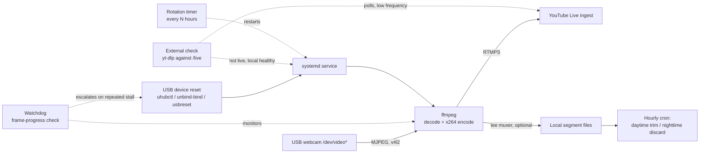

# nestcam-streamer — Technical Specification

**Status:** v2.0 — reviewed and hardened; ready to hand to Claude Code
**License:** GPLv3
**Target:** Claude Code, as a project brief for initial scaffolding

**Review pass (v1.3 → v2.0).** A full-document review ahead of implementation
found four latent defects and several underspecified mechanisms; all are now fixed
in place. Defects: (1) FR6 relied on systemd defaults under which five rapid
failures — e.g. a briefly unplugged camera — would permanently stop restart
attempts, silently defeating the design's core promise; `StartLimitIntervalSec=0`
is now required. (2) FR14 described the rotation as a service restart but never
operationalized the field-measured stop→gap→start sequence; without a deliberate
~150s gap, a near-instant restart resumes the same broadcast and the archive clock
is never reset — the rotation would have run all season while accomplishing
nothing. (3) FR10's hour-granularity segment naming meant any same-hour restart
silently overwrote that hour's earlier footage; naming is now per-segment-start,
FR11's trim aggregates accordingly, and the default container is now MPEG-TS so a
crash truncates rather than destroys the in-progress segment. (4) The tee muxer's
default all-or-nothing failure behavior meant a full archive disk would have
killed the live broadcast; FR9 now mandates asymmetric `onfail` handling.
Hardening: FR7 now specifies ffmpeg's machine-readable `-progress` interface
instead of scraping the unstable status line; FR7c must distinguish
confirmed-not-live from indeterminate (a local network outage must not trigger
restart storms); FR7e gains restart backoff for the terminal case; FR17's doctor
checks now cover the yt-dlp/jq toolchain, archive-path writability, and the FR6
start-limit setting; the config schema gained the corresponding keys and shed
reference-deployment-specific values; acceptance criteria 12–15 pin each fix; and
a new Appendix A records the field-validated ffmpeg command shape so
implementation starts from what actually ran rather than re-deriving it from
prose. Earlier per-version changelogs (v1.0→v1.3, documenting the field-testing
phase) are preserved in this file's git history rather than accumulating here.

## 1. Purpose

A configurable toolkit for unattended, long-duration (multi-week) 24/7 livestreaming
of a low-motion subject — a wildlife nest camera is the reference use case — from a
single fixed USB webcam to YouTube Live, running on modest or older Linux hardware,
with:

- resilient capture/encode/stream via ffmpeg + systemd (not OBS — no compositor
  overhead needed for a static single-source feed),
- local archival recording alongside the live push, with configurable retention,
- automatic workaround for YouTube's ~12-hour continuous-archive limit,
- a health watchdog that catches encoder hangs systemd's own crash-recovery can't see.

The reference deployment is a wood pigeon (*Columba palumbus*) nest camera on a
residential balcony, built around a Logitech Brio 500 and an Intel Sandy
Bridge–generation host. Defaults in this spec match that deployment; every default is
overridable via a single configuration file so the project is usable for other
subjects, other cameras, and other hardware.

## 2. Scope

### 2.1 In scope (v1)

- Single fixed USB (UVC) camera, MJPEG capture.
- Encode via software libx264 (no assumption of hardware encode availability).
- Push to YouTube Live via RTMPS.
- Optional simultaneous local recording (segmented, with retention/trimming policy).
- Scheduled broadcast rotation to stay under YouTube's continuous-archive ceiling.
- Frame-progress watchdog, independent of systemd's process-level restart.
- A single YAML configuration file driving all of the above.
- An environment-validation ("doctor") script encoding the failure modes discovered
  during development (see §9), so new users don't have to rediscover them.

### 2.2 Explicitly out of scope (v1)

- Multi-camera switching or scene composition (this is not an OBS replacement).
- Platforms other than YouTube Live (architecture should not preclude adding one,
  but no other destination ships in v1).
- Downstream video editing / highlight-reel generation (a separate, later tool
  operating on the local archive this project produces).
- A GUI. Configuration is a text file; operation is systemd + cron/timers.

## 3. Non-goals / explicit warnings for the README

These are lessons from the reference deployment that cost real debugging time and
should be documented prominently rather than rediscovered by every user:

- **MJPEG, not YUYV, for 1080p30+ over USB 2.0.** Uncompressed YUYV at 1080p is
  bandwidth-capped by the UVC driver to ~5 fps on USB 2.0; this fails silently — the
  capture "works," just at an unannounced low frame rate — and OBS's on-screen FPS
  counter reports the *compositor's* render rate, not the source's actual capture
  rate, which can mask the problem entirely. The doctor script (§9) must check this.
- **A completely silent or absent audio track can leave YouTube stuck at "Preparing
  stream" indefinitely**, with no error surfaced by ffmpeg. This is not a connection
  problem. See §5.3 for the synthetic noise-floor workaround.
- **A third, distinct failure signature exists beyond a clean process exit and a
  full local stall: ffmpeg can log an error after a device reconnect (e.g. following
  a deliberate USB hub swap) without exiting, continue running in an unclear state,
  and keep an RTMPS session open at YouTube's ingest — evidenced by YouTube later
  showing a "Stream Ended" dialog only once the process was manually killed — while
  never actually surfacing the broadcast as live.** Local frame-progress alone (FR7)
  cannot be trusted to catch this if the frame counter keeps incrementing on stale or
  malformed frames; this is precisely why FR7c's independent, YouTube-side check
  exists rather than relying solely on ffmpeg's own self-reported health.
- **RTMPS, not RTMP, for the YouTube ingest URL**, and it is a different URL from the
  one shown by default in Studio (click the lock icon to reveal it).
- **USB topology matters more than USB spec.** Bus-powered hub chains, active USB
  extenders behaving as extra hub hops, and marginal power budgets under a chained
  hub topology are a common source of unexplained overnight disconnects. The doctor
  script should not attempt to diagnose this (it's physical), but the docs (§10) must
  explain the diagnostic method (`dmesg -T | grep -iE 'usb|uvc'`) clearly.
- **If ambient audio capture is ever enabled** (as opposed to the default synthetic
  noise floor), the README should present this as an actual decision checklist, not a
  vague jurisdiction-dependent disclaimer: (1) who has physical access to the space
  the microphone actually covers — a shared or publicly-visible area is a different
  risk profile than a private space only the operator uses; (2) does sound from
  elsewhere (indoors, adjacent units) leak into that pickup area through an open
  window, door, or thin wall. Both answers can genuinely resolve the concern (solo
  access to the space, no indoor leakage through a closed window, for instance)
  rather than merely mitigate it; the point is that the user should be able to give
  a specific answer to both questions before flipping to `real` mode, not just note
  that "recording laws vary."
- **A live stream key is a disposable credential**, revocable at will from Studio,
  not a long-term secret on the order of a password — the README should say so
  plainly, so users don't over- or under-engineer its handling.

## 4. Architecture overview



Three independent control loops sit around the core ffmpeg process, deliberately
kept separate rather than merged into one script, plus two escalation/verification
steps layered onto them:

1. **systemd `Restart=always`** — recovers from ffmpeg *exiting* (crash, killed
   device, unhandled error).
2. **Watchdog** — recovers from ffmpeg *hanging while still running* (a failure mode
   `Restart=always` cannot see, since the process never exits). If a plain restart
   fails to clear the stall (FR7b), the watchdog escalates to a USB-level device
   reset before retrying — a plain restart alone was empirically insufficient for a
   device left enumerated but wedged.
3. **Rotation timer** — a deliberate, scheduled restart to stay under YouTube's
   archive-length ceiling; this is a *policy* restart, not a failure recovery, and is
   kept out of the watchdog/crash-recovery logic so the two concerns don't tangle.
   Note: its precision no longer needs to be exact for viewer-facing reasons — see
   the note under FR14/FR15 in §5.4 — only reliable enough to periodically break the
   connection before YouTube's continuous-archive ceiling is reached.

A fourth, independent verification step (FR7c/FR7d) checks a signal none of the
above can see: whether YouTube itself is actually broadcasting. Local health
(loops 1–2) only proves ffmpeg is capturing, encoding, and sending data — it says
nothing about whether YouTube accepted that data into a live broadcast, which the
"Preparing stream" incident (§3) showed can silently fail while every local signal
looks perfectly healthy. This check is deliberately routed to a plain restart, not
the FR7b USB-reset path, when local health is otherwise fine — the two escalation
ladders address different failure domains and should not be conflated.

## 5. Functional requirements

### 5.1 Capture / encode / stream (core pipeline)

| ID | Requirement |
|----|-------------|
| FR1 | Capture from a configurable V4L2 device path. Config should reference a stable identifier (udev symlink) rather than `/dev/videoN` directly, since enumeration order is not guaranteed stable across reboots or reconnects. |
| FR2 | Configurable capture format (default `mjpeg`), resolution (default `1920x1080`), frame rate (default `30`). |
| FR3 | Encode via libx264, configurable preset (default `veryfast`), bitrate/maxrate/bufsize (default `6000k`/`6000k`/`12000k`), GOP (default 2× frame rate, i.e. keyframe every 2s), pixel format `yuv420p`. |
| FR4 | Audio mode, one of: `synthetic` (default — `anoisesrc`, very low amplitude, sample rate matched to the real audio device's native rate if `real` mode is ever toggled on, else 48000), `real` (named ALSA/Pulse source, explicit opt-in), `off` (documented as **not recommended** — known to produce the "Preparing stream" hang in §3). |
| FR5 | Output via RTMPS to a configurable ingest URL + stream-key file path. The stream key is **never** stored in the main config file; the config references a path to a separate, `chmod 600` key file, excluded from version control by `.gitignore`. |
| FR6 | Managed via a systemd service unit, `Restart=always`, with `RestartSec` around 10s **and `StartLimitIntervalSec=0`** (or an explicitly generous `StartLimitBurst`). This last setting is load-bearing, not boilerplate: systemd's default start-limit (5 starts within 10s) permanently stops restarting a unit that fails quickly in succession — exactly what happens when the camera is unplugged or wedged and ffmpeg exits immediately on launch. With defaults, a 30-second USB glitch at 3am can leave the service dead for the rest of the season; with the limit disabled and a ~10s `RestartSec`, the service keeps retrying indefinitely and recovers the moment the device returns. |

### 5.2 Health watchdog

| ID | Requirement |
|----|-------------|
| FR7 | A separate process (or systemd timer-triggered script) monitors encode progress and force-restarts the streaming service if the frame counter has not advanced within a configurable timeout (default 60s). **Mechanism: use ffmpeg's `-progress` output (e.g. `-progress /run/nestcam/progress`), not scraping of the human-readable `frame= fps= ...` status line.** `-progress` emits machine-readable `key=value` blocks (including `frame` and `out_time_us`) roughly once per second to a file or socket, purpose-built for supervision; the status line, by contrast, is an unstable interface, uses carriage returns rather than newlines, and under systemd lands in the journal where reliably tailing it from a separate process is needlessly fragile. The watchdog then only needs to compare the last-written `frame` value (and the progress file's mtime, which also catches ffmpeg dying without a final write) between checks. |
| FR7b | **Escalation on repeated stalls.** If a plain service restart (FR7) is followed by another stall detection within the next check interval — i.e. the restart did not actually clear the fault — the watchdog escalates to a USB-level device reset before restarting the service again, rather than repeatedly restarting into the same wedged device. Configurable reset method, attempted in this order of preference: (1) per-port power cycle via `uhubctl`, if the upstream hub supports switchable ports — closest software equivalent to a physical unplug/replug; (2) sysfs driver unbind/bind of the device's USB path; (3) `USBDEVFS_RESET` ioctl as a last, lightest-touch attempt. This tier exists because a real failure mode was observed where the capture device remained enumerated but wedged (sustained `retire_capture_urb` warnings, or a UVC probe-control failure) and only a full device-level reset recovered it — a plain process restart alone did not. |
| FR7c | **External YouTube-side status check, independent of FR7.** Local frame-progress health does not prove YouTube is actually broadcasting the stream — a real failure mode exists (the "Preparing stream" / silent-audio hang, §3) where ffmpeg reports perfectly healthy local progress indefinitely while YouTube never transitions the broadcast to live. A separate, lower-frequency check confirms actual live status via the channel's public `/@<handle>/live` (or `/channel/<id>/live`) redirect. Default implementation: `yt-dlp` querying that URL for its `is_live` field — no API credentials required, and it handles the Google consent-interstitial redirect that a naive `curl`/HTML-scrape would likely hit from EU-region requests. An alternative implementation for users who already have Tier 2 (FR15) API credentials: a cheap `videos.list` call (1 quota unit) against a known video ID for `snippet.liveBroadcastContent`, re-discovering that ID via the more expensive `search.list` (100 units) only immediately after each (re)start/rotation, not on every poll — polling `search.list` on a short interval would exhaust the default daily quota within hours. Either implementation requires a grace period after every (re)start or rotation before treating "not live yet" as a fault (the transition is not instantaneous), and must be explicitly aware of the rotation timer's schedule (FR14) so a deliberate rotation's expected brief gap is not misread as a failure. **The check must also distinguish three outcomes, not two: (a) confirmed live, (b) confirmed not-live (YouTube reachable and answering that no broadcast is live), and (c) indeterminate (network unreachable, DNS failure, `yt-dlp` extraction error from a frontend change, etc.). Only (b) may trigger FR7d — acting on (c) would restart a healthy stream every poll interval for the duration of any ISP outage, and would misdiagnose a `yt-dlp` parser regression as a streaming failure. Indeterminate results are logged and retried, nothing more.** |
| FR7d | If FR7c reports "not live" beyond its grace period **while local frame-progress (FR7) remains healthy**, restart the streaming service directly — do **not** escalate to the FR7b USB-reset path, since a healthy local capture/encode with a rejected or absent YouTube-side broadcast is an ingest/session problem, not a device problem, and a device reset would add unnecessary recovery time without addressing the actual fault. |
| FR7e | **Last-resort escalation beyond plain reconnection.** If FR7d's restart(s) fail to restore live status within a configurable number of consecutive attempts (default: 3) over a bounded window, escalate to the Tier 2 API path (FR15) rather than continuing to restart indefinitely: explicitly transition any ambiguous prior broadcast to `complete`, then `insert` + `bind` + `transition` a definitively new broadcast against the same persistent stream/key. This exists because passive reconnection depends entirely on YouTube's own implicit broadcast-binding logic, which has been observed to behave inconsistently (see development notes referenced in §5.4's rotation caveat) — a state may exist where no amount of blind reconnect-and-hope actually resolves things, and only an explicit broadcast-management call can force resolution. If FR15's API credentials are not configured, this tier is unavailable; the system must log clearly that manual Studio intervention may be required rather than continuing to restart forever with no visible indication that restarting isn't working. **In either terminal case — Tier 2 absent, or Tier 2 attempted and itself failing — the restart cadence must back off (e.g. doubling up to a configurable ceiling such as 30 minutes) rather than continuing to hammer at the base poll interval: the field-observed stuck state was not resolved by restart frequency, and an unbounded tight loop only pollutes logs and YouTube's ingest with connection churn while the actual fix (human or API) is pending.** |
| FR8 | Watchdog restarts are logged distinctly from systemd's own crash-triggered restarts, and USB-reset escalations (FR7b), external-status-triggered restarts (FR7d), and last-resort API recreation (FR7e) are each logged under their own label, so post-hoc log review can tell all of these apart. |

### 5.3 Local archival

| ID | Requirement |
|----|-------------|
| FR9 | Local recording is optional (config toggle, default **on**) and implemented via ffmpeg's `tee` muxer alongside the live push — not a second process competing for the capture device, since most UVC devices only permit one open handle. **Failure isolation between the two tee slaves is mandatory and asymmetric: the archive slave must carry `onfail=ignore` so that a full disk, a failed drive, or a permissions error on the archive path degrades to "no local recording" with a logged error rather than killing the live broadcast (tee's default is to abort the whole muxer when any slave fails); the RTMPS slave must keep the default abort behavior, so a dead network push causes ffmpeg to exit and systemd to restart it. Additionally use tee's `use_fifo=1` so a slow or stalling disk buffers independently instead of back-pressuring the network output.** |
| FR10 | Local files are segmented (default: hourly, via the `segment` muxer with `strftime` naming) so a crash loses at most one segment, not an unbounded recording. **Two details are load-bearing here. First, segment filenames must be unique per segment *start*, not per hour — e.g. `%Y%m%d_%H%M%S`, not `%Y%m%d_%H`: with hour-only naming, any service restart within the same wall-clock hour (watchdog, rotation, crash recovery — all routine in this design) reopens the same filename and silently destroys the earlier partial segment. Second, the default segment container should be MPEG-TS (`segment_format: mpegts`), not MP4: a TS file truncated by a crash mid-segment remains readable up to the last written packet, whereas an unfinalized MP4 segment is typically unrecoverable. Given this system is explicitly designed around the expectation of crashes and restarts, the crash-tolerant container is the correct default; H.264+AAC carry in TS without issue, `-c copy` trimming works on it directly, and remuxing to MP4 for editing later is a lossless one-liner.** |
| FR11 | A retention policy, run hourly via cron/systemd-timer shortly after each segment closes: within a configurable daytime window (`daytime_start`/`daytime_end`, default `04:00`–`20:30`), trim the segments of each hour to a configurable total duration (`daytime_keep_minutes`, default: keep full hour — see §11 for sizing discussion); outside the window, delete the segments entirely (`nighttime_discard`). Trimming uses stream copy (`-c copy`), not re-encode, for speed. **Because FR10's naming is per-start rather than per-hour, an hour may contain several segment files (restarts split them); the trim job must select by hour *prefix* and treat the set as that hour's footage — keeping up to the configured total duration across the set, oldest-first — rather than assuming exactly one file per hour.** |
| FR12 | The project does **not** auto-compute or enforce a storage budget (drive sizes vary too much to hardcode), but the doctor script and README must show the sizing formula: `bitrate × retained-seconds-per-day × total-days`, so users can size their own storage before committing to a retention window. |
| FR13 (optional, off by default) | A batch re-encode script (libx265, configurable preset/CRF) for shrinking the local archive after the fact, explicitly designed to run at low priority (`nice`/`ionice`) and documented as unsuitable for real-time use on older CPUs — this is a background job, run against already-closed segments, never in the live path. |

### 5.4 Broadcast rotation (12-hour archive workaround)

| ID | Requirement |
|----|-------------|
| FR14 | **Default mechanism:** a systemd timer triggers `nestcam-rotate.sh` on a configurable interval (default `11h45m`, comfortably under YouTube's ~12h continuous-archive limit), against the same persistent/reusable stream key. **The rotation is a stop → deliberate gap → start sequence, not a bare `systemctl restart`: field testing established that a near-instant reconnect resumes the *same* broadcast (defeating the rotation's entire purpose, per the archive-clock risk below), while a gap of ~100 seconds reliably closed the old broadcast and produced a new one on reconnect. The gap is configurable (`rotation.min_gap_seconds`), defaulting to 150s — deliberate margin above the measured ~100s threshold, since that threshold is YouTube's undocumented behavior and may shift.** This relies on YouTube automatically starting a new broadcast/archive when a connection resumes after the prior one has fully ended — the README must state this assumption explicitly and tell the user how to confirm their stream key is in reusable/persistent mode in Studio, since this is a prerequisite, not something the tool can verify remotely. The external check's rotation grace period (FR7c) must cover the full interval-plus-gap, not just the interval. |
| FR15 (optional, off by default, but see FR7e — and see the field note below, which upgrades this from a theoretical safeguard to one addressing a reproduced failure) | A YouTube Data API–based mode using `liveBroadcasts.insert` / `bind` / `transition`, providing two distinct capabilities: (a) overlap-free scheduled rotation with custom per-segment titles/descriptions/category, as an alternative to FR14's restart-based default; and (b) — via FR7e — the only mechanism confirmed able to force resolution when passive reconnection leaves a broadcast stuck in "Preparing stream" despite a locally-healthy stream. Requires OAuth2 setup (interactive consent once, then a stored refresh token for unattended use), documented as a "Tier 2" extension. Users who skip this tier accept a real, now-reproduced risk (not merely a theoretical edge case): field testing found repeated plain restarts against the same stuck broadcast — blind, with Studio open, and even via a "start new session" click made from that stuck broadcast's own management page — all failed across roughly 20 minutes and multiple attempts; only abandoning that broadcast context entirely and starting fresh from the channel root resolved it. The exact server-side mechanism remains unconfirmed (total elapsed time and context-abandonment were not cleanly isolated during testing), but the practical conclusion holds regardless: FR7d's plain-restart path is not guaranteed to self-resolve this state within any bounded number of attempts, which is exactly the condition FR7e is designed to escalate past. This tier is also the natural place to automate setting the video category (see §3, Studio category defaults) rather than relying on a manual per-broadcast Studio step. |

**Note on viewer-facing stability (README must cover this):** FR14's restart-based rotation does not guarantee a predictable video-ID boundary — empirically, a reconnect can sometimes resume the *same* broadcast well past the short "resume window" typically documented, apparently correlated with an active Studio session, and the exact mechanism was not fully pinned down during development. Rather than engineering FR14/FR15 to guarantee a clean split (which FR15 *can* do via an explicit `transition` to `complete`, but at real integration cost), the recommended practice is to decouple viewer experience from the rotation mechanism entirely: document and default to `https://www.youtube.com/@<handle>/live` (or `/channel/<id>/live`) as the link users share and embed. That permanent redirect always resolves to whatever is currently live, making video-ID churn under rotation a non-issue for viewers regardless of which rotation tier is in use. This lowers the bar for FR14's default: it no longer needs to behave precisely, only to periodically break the connection for long enough that YouTube's archive isn't silently lost past its continuous-recording ceiling — clean archive-splitting on YouTube's own copy is a secondary concern once the project's local archive (§5.3) is treated as authoritative.

**A second, distinct risk, worth naming explicitly rather than leaving implicit:** the passive-reconnection behavior above cuts both ways. If a scheduled FR14 restart happens to *resume* the same broadcast rather than starting a fresh one, that broadcast's continuous-duration clock — the thing actually driving YouTube's ~12h archival ceiling — is not reset by the restart at all, regardless of how cleanly ffmpeg reconnects or how invisible the interruption is to viewers. A restart that looks completely successful can therefore still fail to accomplish FR14's original purpose. This is not the same problem as viewer-URL stability above, and the `/live` redirect recommendation does nothing to fix it — it's addressed only by FR15's explicit `transition` to `complete`, which forces the prior broadcast closed regardless of implicit timing behavior. FR14-only deployments should treat this as a real, currently unquantified residual risk rather than an edge case, and weigh it directly against the OAuth setup cost when deciding whether Tier 2 is worth adopting — per the open question already raised in §11.

### 5.4.1 Tier 2 API call sequence (reference implementation for `api/rotate_via_api.py`)

The resource and method reference for everything below is Google's `liveBroadcasts`
documentation: <https://developers.google.com/youtube/v3/live/docs/liveBroadcasts>,
which lists `list, insert, update, delete, bind, transition, cuepoint` as the
supported operations on this resource. The sequence exists to replace an
empirically-validated but implicit manual recipe (kill the encoder → open a fresh
Studio session → restart the encoder) with explicit, individually-checkable API
calls, so that no step depends on undocumented session/timeout behavior in the
Studio UI.

1. **Close the outgoing broadcast explicitly.** `liveBroadcasts.transition` with
   `broadcastStatus=complete` on the prior broadcast ID, rather than letting it end
   implicitly on disconnect. Method reference:
   <https://developers.google.com/youtube/v3/live/docs/liveBroadcasts/transition>.
2. **Create the new broadcast.** `liveBroadcasts.insert` (title, privacy status,
   scheduling metadata as needed).
3. **Bind it to the existing persistent stream** — not a new one. `liveBroadcasts.bind`,
   passing the `id` of the already-existing `liveStream` resource whose ingest URL
   and key never change: <https://developers.google.com/youtube/v3/live/docs/liveBroadcasts/bind>.
   The Live Streaming API overview describes `bind` as linking a `liveBroadcast`
   resource with a `liveStream` resource (or removing such a link)
   (<https://developers.google.com/youtube/v3/live>), which is exactly the
   attach-to-persistent-key behavior this step needs.
4. **Start (or restart) ffmpeg only after step 3, not before.** This ordering isn't
   a style preference — it matches a documented precondition on the next step.
5. **Poll `liveStreams.list` for `status.streamStatus == active`**, confirming
   YouTube is actually receiving the incoming RTMPS data, not merely that ffmpeg
   believes it connected.
6. **Only then transition the new broadcast to `live`.** Google's own transition
   documentation states this explicitly: *"Before calling this method, you should
   confirm that the value of the `status.streamStatus` property for the stream
   bound to your broadcast is active"*
   (<https://developers.google.com/youtube/v3/live/docs/liveBroadcasts/transition>).
   Calling `transition` before that precondition holds is calling it out of order,
   not merely early. `enableAutoStart` on the broadcast's `contentDetails` can make
   this step implicit rather than a manual call, if preferred.

**Auth and quota, both load-bearing for an unattended script:** `insert`, `bind`,
and `transition` are write operations and require OAuth2 authorization with scope
`https://www.googleapis.com/auth/youtube` or `.../auth/youtube.force-ssl` — the
read-only scope will not authorize any of them (scope list on the same transition
reference page above). Consent is interactive and can't run headless; do it once,
store the resulting refresh token securely (same handling discipline as the stream
key file — not committed, restrictive permissions), and mint short-lived access
tokens from it thereafter. On cost: Google's quota-cost reference
(<https://developers.google.com/youtube/v3/determine_quota_cost>) shows write
operations across the Data API generally priced in the tens-of-units range against
a default daily budget of 10,000 — a rotation firing at most a handful of times a
day, each cycle costing a small fixed number of calls from the sequence above, is
nowhere near that ceiling. This is a materially cheaper access pattern than FR7c's
`search.list` fallback (100 units *per call*, explicitly why FR7c avoids polling it
on a short interval) — another reason to prefer the `yt-dlp`-based external check
for routine polling and reserve API quota for the rotation/escalation calls that
actually need it.

### 5.5 Configuration

| ID | Requirement |
|----|-------------|
| FR16 | A single YAML config file (`config.yaml`, from `config.example.yaml`) is the source of truth for every tunable in §5.1–5.4. No script should hardcode a path, device name, resolution, or bitrate — everything reads from this file. |
| FR17 | A "doctor" script, run before first use and referenced in the README as the required first step, checks: <br>• `v4l2-ctl --list-formats-ext` output for the configured device, confirming the configured resolution/fps combination actually exists for the configured pixel format (catches the YUYV/MJPEG trap in §3) <br>• ffmpeg build flags include `libx264`, `--enable-gnutls` or equivalent (RTMPS support) <br>• stream key file exists, is `600`, and is excluded from git <br>• presence of a udev rule for the configured device symlink <br>• (if `real` audio mode) that the configured ALSA/Pulse source is enumerable and not exclusively locked <br>• (if external check enabled) that `yt-dlp` and `jq` are installed, and that `yt-dlp` can extract the configured `/live` URL right now — a version check alone doesn't prove the extractor still works against YouTube's current frontend <br>• that `archive.segment_dir` exists and is writable by the service user <br>• that the installed `nestcam-stream.service` actually disables the systemd start limit per FR6, since a unit file edited or replaced without that setting silently reintroduces the give-up-after-rapid-failures trap |

## 6. Non-functional requirements

- **Portability of encode path:** software x264 is the default and must work
  unassisted on old hardware (reference: Intel Sandy Bridge–era quad-core, no
  discrete GPU). Hardware-accelerated encode (VAAPI/QSV) may be detected and offered
  as an opt-in performance mode, never assumed present.
- **No cloud dependency for the default tier.** FR14's rotation mechanism must not
  require Google API credentials; that requirement is confined to the optional Tier 2
  (FR15).
- **Logging:** rely on the systemd journal rather than inventing a separate logging
  framework; each component (stream service, watchdog, rotation timer, archive-trim
  job) should have a distinguishable unit name so `journalctl -u <unit>` isolates it.
- **License:** GPLv3, `LICENSE` file at repo root, SPDX headers in scripts.

## 6a. System Dependencies

Reference environment during development: Debian 13 (trixie), ffmpeg
`7.1.5-0+deb13u1` from the stock repository, PipeWire (with `pipewire-pulse`) as the
default audio stack. Every build flag relied on below was already present in that
stock package — no non-free or third-party repository was needed. Other
Debian/Ubuntu-family releases should behave identically as long as the same ffmpeg
build flags are present; verify with `ffmpeg -version` rather than assuming, since
older releases or minimal/server images can ship a differently-configured build.

**Quickstart for the core (Tier 1) dependencies:**
```bash
sudo apt update
sudo apt install -y ffmpeg v4l-utils usbutils procps jq uhubctl
```
`yt-dlp` is deliberately excluded from this one-liner — see below.

### Core (Tier 1, required for any deployment)

| Purpose | Package (Debian/Ubuntu) | Notes |
|---|---|---|
| Capture, encode, mux, stream | `ffmpeg` | Must be built with `--enable-libx264` (H.264 encode) and a TLS backend (`--enable-gnutls` or `--enable-openssl`, for RTMPS). Confirmed present in the reference package; verify via `ffmpeg -version` elsewhere rather than assuming. |
| Camera format/mode inspection, manual exposure lock | `v4l-utils` | Provides `v4l2-ctl`, used by the doctor script (FR17) and the manual exposure-lock workaround in §3. |
| USB topology diagnosis | `usbutils` | Provides `lsusb`/`lsusb -t`, referenced throughout `docs/HARDWARE.md` and `TROUBLESHOOTING.md`. |
| Process management in scripts | `procps` | Provides `pgrep`/`pkill`, used by `nestcam-watchdog.sh` and `nestcam-rotate.sh` to locate and signal the ffmpeg process. |
| Service supervision, timers, journal | `systemd` | Base init system; not separately installed on Debian/Ubuntu. |
| Stable device naming | `udev` | Ships with `systemd` on Debian/Ubuntu; no separate package. Run `udevadm control --reload && udevadm trigger` after installing the project's rule. |
| JSON parsing in shell scripts | `jq` | Used by `nestcam-status-check.sh` to read `yt-dlp -j`'s `is_live` field without pulling in a full Python dependency for a bash script. |
| External live-status verification (FR7c) | `yt-dlp` — **not** via `apt` | yt-dlp tracks YouTube's frontend closely; a distro-packaged version can lag and silently misparse the page. Install via `pip install --break-system-packages yt-dlp` (in a venv if preferred) or the standalone binary from the project's GitHub releases, and note the installed version in `config.example.yaml`'s comments so a future regression has a known-good version to roll back to. |

### Escalation tier (FR7b — recommended, degrades gracefully if absent)

| Purpose | Package | Notes |
|---|---|---|
| Per-port USB power cycling (preferred method) | `uhubctl` | Packaged in Debian since roughly Buster. Confirm the specific hub in use actually supports switchable per-port power (`uhubctl` with no arguments lists this) before relying on it as the primary method — not all hub chipsets support it, though Genesys Logic-based hubs commonly do. |
| sysfs driver unbind/bind (fallback) | none — uses `/sys/bus/usb/drivers/usb/{unbind,bind}` directly | No package; requires root, which the watchdog already runs as. |
| `USBDEVFS_RESET` ioctl (last-resort fallback) | not packaged on Debian as of this writing | Typically built from the small, widely-circulated single-file `usbreset.c` (`gcc -o usbreset usbreset.c`) rather than installed from a repository — confirm this hasn't changed before assuming a from-source build is still necessary. |

### Optional: local archive re-encoding (FR13)

| Purpose | Package | Notes |
|---|---|---|
| x265 encode support | bundled in `ffmpeg` | Confirmed present via `--enable-libx265` in the reference build; no separate package. |
| Low-priority scheduling | `coreutils` (`nice`) + `util-linux` (`ionice`) | Both present by default on Debian/Ubuntu; listed for completeness since `nestcam-reencode.sh` depends on them explicitly. |

### Optional: Tier 2 API rotation & last-resort recovery (FR15/FR7e)

| Purpose | Package | Notes |
|---|---|---|
| Runtime for the API script | `python3`, `python3-venv` | Isolate Tier 2's dependencies in a virtualenv rather than the system Python. |
| Google API client libraries | `google-api-python-client`, `google-auth-httplib2`, `google-auth-oauthlib` | Installed via `pip install` inside the venv; not worth relying on Debian's packaged versions of these. |
| One-time interactive OAuth consent | any browser, once (local or SSH-forwarded) | Only needed to produce the stored refresh token; unattended operation thereafter uses the token, not interactive login. |

### Audio, conditional on `audio.mode` (FR4)

| Mode | Dependency |
|---|---|
| `synthetic` (default) | None beyond `ffmpeg` itself — `anoisesrc`/`anullsrc` are built into `libavfilter`. |
| `real` | A working PipeWire (`pipewire`, `pipewire-pulse`, `wireplumber`) or PulseAudio (`pulseaudio`, `pulseaudio-utils`) stack providing `pactl`. Capture through Pulse/PipeWire by source name (`pactl list sources short`), not a raw ALSA `hw:`/`plughw:` device node — the reference deployment hit a `Device or resource busy` conflict attempting the latter, since the desktop audio server already holds the device open exclusively. |
| `off` | Not recommended — see §3. |

### Development/CI-only (not needed on the deployed host)

| Purpose | Package |
|---|---|
| Shell script linting | `shellcheck` |
| Config schema validation | left to the implementer (e.g. `python3-yaml` plus a small validator, or an existing JSON-schema tool) |

### Explicit non-dependencies

- **No OBS.** The project deliberately bypasses it (§1); it should not appear as a
  dependency anywhere in the default pipeline.
- **No cloud storage client of any kind.** Local archival (§5.3) writes to local
  disk only; nothing in Tier 1 or the escalation tier talks to an object-storage API.

## 7. Proposed repository layout

```
nestcam-streamer/
├── LICENSE
├── README.md
├── SPEC.md                        (this document)
├── config.example.yaml
├── .gitignore                     (must exclude config.yaml, *.key, stream_key*)
├── bin/
│   ├── nestcam-stream.sh          # renders the ffmpeg command from config, execs it
│   ├── nestcam-watchdog.sh        # frame-progress check, restarts stream unit
│   ├── nestcam-usb-reset.sh       # escalation: uhubctl / unbind-bind / usbreset (FR7b)
│   ├── nestcam-status-check.sh    # external /live verification via yt-dlp (FR7c/FR7d)
│   ├── nestcam-rotate.sh          # scheduled restart for archive rotation (FR14)
│   ├── nestcam-archive-trim.sh    # hourly retention pass (FR11)
│   ├── nestcam-reencode.sh        # optional batch x265 pass (FR13)
│   └── nestcam-doctor.sh          # environment validation (FR17)
├── api/                            # Tier 2, optional, not built by default
│   └── rotate_via_api.py          # implements the §5.4.1 call sequence: transition
│                                  # old broadcast to complete, insert + bind new
│                                  # broadcast to the persistent stream, wait for
│                                  # streamStatus=active, transition to live (FR15)
├── systemd/
│   ├── nestcam-stream.service
│   ├── nestcam-watchdog.service
│   ├── nestcam-watchdog.timer
│   ├── nestcam-status-check.service
│   ├── nestcam-status-check.timer
│   ├── nestcam-rotate.service
│   ├── nestcam-rotate.timer
│   ├── nestcam-archive-trim.service
│   └── nestcam-archive-trim.timer
├── udev/
│   └── 99-nestcam.rules.example
├── docs/
│   ├── HARDWARE.md                 # camera/hub/power selection notes, §10
│   └── TROUBLESHOOTING.md          # §3 pitfalls, expanded with diagnostic commands
└── tests/
    └── shellcheck + config-schema validation (CI)
```

## 8. Configuration schema (illustrative — Claude Code should treat this as a
starting draft, not a frozen contract)

```yaml
camera:
  device: /dev/nestcam            # stable udev symlink, not /dev/videoN
  input_format: mjpeg
  resolution: "1920x1080"
  framerate: 30

encode:
  preset: veryfast
  tune: ""                        # empty = none. "zerolatency" was field-tested and works,
                                  # but costs compression efficiency (disables lookahead)
                                  # for a latency benefit that is irrelevant to this
                                  # content — nobody needs sub-second latency on a nest.
                                  # Leave empty unless CPU headroom is tight.
  bitrate_kbps: 6000
  maxrate_kbps: 6000
  bufsize_kbps: 12000

audio:
  mode: synthetic                 # synthetic | real | off
  synthetic_amplitude: 0.001
  sample_rate: 48000
  real_source: ""                 # e.g. alsa_input.usb-...analog-stereo (Pulse) — only used if mode: real

youtube:
  ingest_url: "rtmps://a.rtmps.youtube.com/live2"
  stream_key_file: /etc/nestcam/stream_key   # chmod 600, never in git
  rotation:
    mode: restart                 # restart (FR14) | api (FR15, Tier 2)
    interval: "11h45m"
    min_gap_seconds: 150          # restart mode only: deliberate stop→start gap.
                                  # Field-measured: ~100s reliably forces a new
                                  # broadcast; shorter gaps resume the old one and
                                  # do NOT reset the 12h archive clock. Keep margin.

archive:
  enabled: true
  segment_dir: /var/lib/nestcam/archive
  segment_length_seconds: 3600
  segment_format: mpegts           # crash-tolerant; see FR10. mp4 loses the
                                   # in-progress segment on any crash.
  daytime_start: "04:00"
  daytime_end: "20:30"
  daytime_keep_minutes: 60         # minutes retained per hour, 1-60, summed across
                                   # that hour's segments (restarts split hours into
                                   # several files — see FR11)
  nighttime_discard: true

watchdog:
  check_interval_seconds: 30
  stall_timeout_seconds: 60
  progress_file: /run/nestcam/progress   # ffmpeg -progress target; see FR7
  usb_reset:
    enabled: true
    escalate_after_restarts: 1      # plain restarts to try before escalating
    method: uhubctl                 # uhubctl | unbind | usbreset, tried in that
                                     # preference order if the configured method fails
    hub_location: ""                # uhubctl -l value, only used if method: uhubctl
    port: ""                        # port number on that hub
    usb_path: ""                    # bus-port id (e.g. "3-4.1.4"), used by unbind/bind
                                    # and usbreset fallbacks. Note: the bus number can
                                    # change across reboots even when the physical port
                                    # doesn't (observed in the field: same port, bus 2
                                    # one boot, bus 3 another) — prefer deriving this
                                    # at runtime from the udev symlink's sysfs path
                                    # rather than hardcoding it here.

external_check:
  enabled: true
  method: yt-dlp                    # yt-dlp (no credentials) | api (Tier 2 key required)
  channel_live_url: "https://www.youtube.com/@YOUR_HANDLE/live"
  poll_interval_seconds: 180
  grace_period_after_restart_seconds: 300   # suppress alerts this long after any (re)start
  grace_period_after_rotation_seconds: 480  # must exceed rotation min_gap_seconds plus
                                            # YouTube's own go-live latency; see FR14
  max_restarts_before_escalation: 3         # FR7e threshold
  backoff_ceiling_seconds: 1800             # FR7e: max restart backoff once escalation
                                            # is exhausted or unavailable

reencode:
  enabled: false
  codec: libx265
  preset: faster
  crf: 26
```

## 9. Acceptance criteria

1. On a clean environment with a UVC webcam attached, `nestcam-doctor.sh` correctly
   flags: a YUYV-only high-resolution mode lacking the requested frame rate; a
   missing/incorrectly-permissioned stream key file; an ffmpeg build without RTMPS
   support; absence of a udev rule for the configured device path.
2. `systemctl start nestcam-stream` results in a visible live stream on the
   configured YouTube channel within a reasonable startup window, using only
   `config.yaml` plus the stream key file as inputs.
3. Killing the ffmpeg process (`kill -9`) results in automatic recovery via
   `Restart=always` within the configured `RestartSec`.
4. Simulating a stall (e.g., `kill -STOP` on the ffmpeg process) results in the
   watchdog detecting no frame progress and restarting the unit within
   `stall_timeout_seconds` plus one check interval.
5. The rotation timer fires at the configured interval and a new broadcast/VOD
   appears in the channel's content list without manual intervention, given a
   persistent/reusable stream key.
6. The archive-trim job correctly retains only the configured daytime window at the
   configured per-hour duration, discarding nighttime segments entirely, verified
   over at least a 24-hour cycle.
7. With a device artificially left in a wedged-but-enumerated state (e.g. via a
   contrived driver-level fault, since this is hard to trigger deterministically),
   a plain watchdog restart alone fails to restore frame progress, and the
   escalation in FR7b correctly performs the configured USB reset method before a
   subsequent restart succeeds. This is inherently harder to test reliably than the
   other criteria here and may require manual/hardware-dependent verification rather
   than full CI automation.
8. Regardless of rotation precision or timing, `https://www.youtube.com/@<handle>/live`
   resolves to whatever broadcast is currently live at any point during a rotation
   cycle, confirming viewers never need a specific video ID.
9. With ffmpeg's local frame-progress healthy but the YouTube-side broadcast
   deliberately prevented from going live (e.g. by reproducing the silent-audio
   "Preparing stream" condition from §3), the external check (FR7c) detects
   "not live" past its grace period and triggers a plain restart (FR7d) — and does
   **not** trigger the FR7b USB-reset path, confirming the two escalation ladders
   stay independent.
10. A scheduled rotation (FR14) firing during the external check's normal polling
    does not produce a spurious alert or restart, confirming the two mechanisms are
    correctly coordinated rather than fighting each other.
11. FR7e's escalation logic correctly counts consecutive failed restarts and invokes
    the Tier 2 API path once the configured threshold is reached, and correctly logs
    a clear "manual intervention may be needed" message when Tier 2 credentials are
    absent. The underlying failure condition it escalates from was, at the time of
    v1.0, not reliably reproducible — it has since been reproduced directly in the
    field (a broadcast stuck at "Preparing stream" with a locally-healthy stream,
    surviving multiple plain restarts and a Studio "start new session" click made
    from the stuck broadcast's own page, resolved only by abandoning that context
    and starting fresh from the channel root). The precise triggering precondition
    is still not well enough understood to reproduce on demand for CI, so this
    criterion should still be tested by mocking the "still not live after N
    restarts" condition directly, but it should no longer be treated as a purely
    theoretical scenario when deciding whether to implement FR15 at all.
12. With archiving enabled, making `segment_dir` unwritable mid-stream (or filling
    its filesystem) does **not** interrupt the RTMPS push: the live broadcast
    continues, the archive slave's failure is logged, and recovery of the archive
    path does not require restarting the stream (FR9's `onfail=ignore`).
13. Two service restarts within the same wall-clock hour produce two distinct
    archive segment files — the first is not overwritten by the second (FR10) —
    and the subsequent trim pass processes both as that hour's footage (FR11).
14. A rotation in `restart` mode observes the configured `min_gap_seconds` between
    stop and start, and the post-rotation check confirms a **different** video ID
    than before the rotation — a rotation that resumes the same broadcast is a
    test failure, not a pass, since it leaves the archive clock running (FR14,
    §5.4 second risk).
15. With the network to YouTube deliberately blackholed (e.g. an nftables drop rule)
    while ffmpeg's local pipeline is healthy, the external check reports
    *indeterminate*, logs it, and does **not** restart the service (FR7c outcome
    (c)); restoring the network without any restart returns the check to
    "confirmed live."

## 10. Documentation deliverables

- `README.md`: quickstart, config reference, the §3 warnings up front (not buried),
  license, and an explicit recommendation to share/embed the channel's
  `/@handle/live` redirect rather than any specific broadcast URL, since rotation
  does not guarantee a stable video ID (see §5.4 note).
- `docs/HARDWARE.md`: camera selection guidance, USB topology guidance, autofocus
  guidance, and outdoor deployment notes, detailed below.

  **USB topology, specifically:** minimize hub hops to the camera; a powered hub
  must sit as the *final* hop immediately before the camera to actually help —
  placed further upstream with unpowered hubs still between it and the camera, it
  does not reliably fix leaf-device power/negotiation faults, since the marginal
  current budget it's meant to correct is consumed at the hop(s) closest to the
  device, not at the chain's root. Active extension cables enumerate as their own
  hub-like device in `lsusb -t`/`dmesg` output and are not equivalent to, or a
  substitute for, a powered hub. Three distinct dmesg failure signatures are worth
  distinguishing when diagnosing instability, since they point at different (though
  possibly related) causes:

  | Signature | What it looks like | Likely meaning |
  |---|---|---|
  | Hard disconnect | `USB disconnect` + a new device number assigned shortly after | Device fully dropped off the bus and re-enumerated |
  | Soft freeze | Repeated `retire_capture_urb: N callbacks suppressed`, no disconnect line | Device stays enumerated but isochronous capture is degrading; often recoverable only by a device-level reset (FR7b), not a process restart |
  | Wedged post-(re)enumeration | `Failed to set UVC probe control : -32` right after a `Found UVC ... device` line | Device came back from a disconnect/reset in a state where UVC negotiation itself fails; sometimes self-clears on the *next* open attempt, sometimes needs a further physical reseat |

  A cascade of `USB disconnect` lines across multiple hub tiers simultaneously,
  triggered by a deliberate physical reconnect (unplugging a hub to rewire the
  chain, for instance), is expected noise from the intervention itself and should
  not be read as evidence of an ongoing fault — only disconnects with no
  corresponding physical action behind them are diagnostically meaningful.

  **Autofocus, specifically — a counterintuitive point worth stating plainly:** for
  a genuinely static subject at a fixed camera distance, locking focus (via the UVC
  `focus_automatic_continuous`/`focus_absolute` controls, settable through
  `v4l2-ctl`, the same pattern as locking exposure) removes autofocus hunting as a
  variable. But if the subject's depth will drift gradually over the deployment — a
  nest's contents building up under a sitting bird, young growing and changing the
  effective subject plane over several weeks — a fixed focus value tuned on day one
  can go stale by week three with nobody present to re-tune it. In that case,
  leaving continuous autofocus enabled and accepting occasional hunting/soft frames
  is the more robust default for an unattended multi-week run, even though it looks
  less "correct" than a locked value. Document both options and let the user judge
  which describes their subject, rather than defaulting to a lock on the assumption
  that stability always beats adaptability.

  Consumer autofocus algorithms on webcams marketed for video calls are commonly
  weighted toward face-like features (a well-defined eye against lighter
  surrounding tissue is a strong contrast target); expect hunting when
  higher-contrast foreground clutter (branches, enclosure bars, glass reflections)
  competes with a lower-contrast subject for the algorithm's attention. Don't
  mistake this for a minimum-focus-distance limit or a compression artifact —
  compare two frames taken moments apart at otherwise-identical settings; if
  sharpness varies between them, it's a focus decision, not the codec.

  **Outdoor deployment:** weatherproofing consumer USB electronics that were never
  rated for it — condensation and heat matter even under a roof that blocks rain
  directly, since neither the camera nor any auxiliary electronics (e.g. a
  supplementary light) are IP-rated, and both still see full ambient humidity and
  temperature swings.

  **A device can also fail wedged-but-enumerated rather than disconnected** (the
  soft-freeze or post-reset-negotiation-failure signatures above) and requires an
  actual device-level reset rather than a process restart to recover — see FR7b.
- `docs/TROUBLESHOOTING.md`: expanded write-ups of each §3 item with the actual
  diagnostic commands and log signatures to look for, plus a field-observed entry
  for the FR15/FR7e stuck-broadcast state: YouTube's Stream Health tab can report
  "healthy"/"excellent" while the broadcast preview sits at "Preparing stream"
  indefinitely — these are evidently two separate subsystems (transport health vs.
  broadcast-binding state), and a healthy-looking health tab should not be read as
  "the stream is actually live." For users without Tier 2 configured, document the
  manual fallback recipe found during testing: repeated plain restarts, and even a
  Studio "start new session" click made *from the stuck broadcast's own management
  page*, did not resolve it — only fully closing the console and initiating a new
  session from the channel-root livestreaming URL (not the stuck video's own URL)
  produced a working broadcast. Present this as a manual last resort with the
  caveat that the precise mechanism isn't fully understood, rather than as a
  guaranteed fix.

## 11. Known open questions for contributors (not blocking v1)

- Sizing guidance in §5.3/FR12 is deliberately a formula, not a fixed number — should
  the doctor script *estimate* required storage from the configured retention window
  and warn if free disk space looks insufficient, without enforcing anything?
- Tier 2 (FR15) is the natural home for automating video title/description/category
  per rotated broadcast; should Tier 1 (default) at least document the manual Studio
  step clearly, given category is not remotely settable without the API?
- Multi-destination output (e.g., simultaneous Twitch or a self-hosted RTMP) is out
  of scope for v1 but the `youtube:` config block should probably become a list of
  `destinations:` in a later version rather than requiring a breaking config change
  — worth deciding the shape now even if only one destination ships initially.
- Motion-triggered or activity-weighted archival sampling (retaining more of an hour
  when there's visible motion, less when static) is a plausible v2 feature building
  on FR11, deliberately deferred to avoid scope creep in v1.
- **Resolved, given field evidence:** FR15/Tier 2 now serves double duty (rotation
  precision and FR7e's last-resort recovery), and the triggering condition for the
  latter has since been reproduced directly (see the FR15 field note and acceptance
  criterion 11) rather than remaining a theoretical edge case. The README should
  recommend Tier 2 more strongly than a bare "optional, advanced" framing — present
  it as strongly recommended for any unattended deployment expected to run
  unsupervised for more than a day or two, while still being honest that it remains
  technically optional and that the OAuth setup cost is real. This isn't a judgment
  call to defer to contributors anymore; it's a documentation-tone decision that
  should ship with v1, informed by the reproduction described above.

## Appendix A — Field-validated reference pipeline

`nestcam-stream.sh` renders its ffmpeg command from `config.yaml`; this appendix
records the command *shape* it should render, derived from the invocation that ran
successfully for multi-hour stretches on the reference deployment. Implement from
the requirements, but treat structural departures from this shape as needing a
reason.

**Archive disabled (single output), synthetic audio:**

```bash
ffmpeg \
  -thread_queue_size 512 \
  -f v4l2 -input_format mjpeg -video_size 1920x1080 -framerate 30 -i /dev/nestcam \
  -f lavfi -i "anoisesrc=color=white:amplitude=0.001:sample_rate=48000" \
  -map 0:v -map 1:a \
  -c:v libx264 -preset veryfast \
  -b:v 6000k -maxrate 6000k -bufsize 12000k \
  -pix_fmt yuv420p -g 60 -keyint_min 60 \
  -c:a aac -b:a 128k -ar 48000 \
  -progress /run/nestcam/progress \
  -f flv "rtmps://a.rtmps.youtube.com/live2/${YT_KEY}"
```

For `audio.mode: real`, the lavfi input line becomes `-f pulse -i <real_source>` —
capture through PipeWire/Pulse by source name, never a raw `hw:`/`plughw:` node
(§6a, audio table). Append `-tune zerolatency` after the preset only if
`encode.tune` says so.

**Archive enabled (tee muxer), same front half, output section becomes:**

```bash
  -f tee -use_fifo 1 \
  "[f=flv:onfail=abort]rtmps://a.rtmps.youtube.com/live2/${YT_KEY}|\
[f=segment:segment_time=3600:segment_format=mpegts:strftime=1:reset_timestamps=1:onfail=ignore]\
/var/lib/nestcam/archive/%Y%m%d_%H%M%S.ts"
```

The asymmetric `onfail` settings and per-start `%Y%m%d_%H%M%S` naming are
requirements (FR9, FR10), not stylistic choices. Notes for the implementer:
`-thread_queue_size` precedes the input it applies to; the MJPEG software decode
pegs one core for a stretch at startup before settling — expected, not a hang, so
the watchdog's first check must tolerate startup (FR7c's grace-period logic applies
to the local watchdog's first cycle too); and the stream key is interpolated from
the key file (FR5), never inlined in the unit file or script where `ps` would
expose it — a low-stakes credential (§3), but there's no reason to leak it either.
